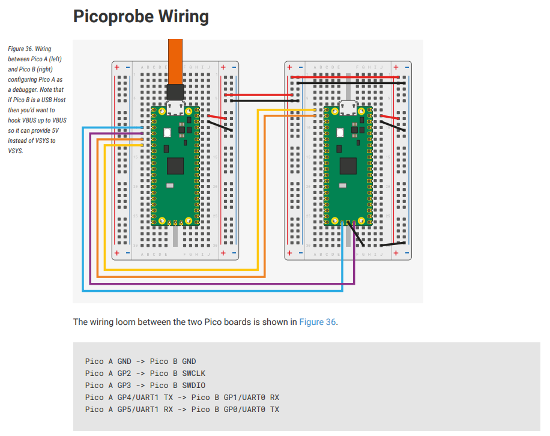
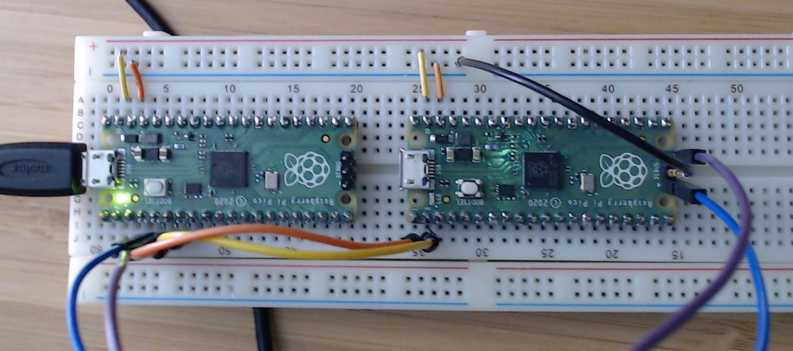

# Pi Pico projects in VS Code from WSL

This is a summary of steps for using the Rapberry Pi Pico in VS Code using WSL on Windows. You should absolutely use the the [Pico SDK docs](https://datasheets.raspberrypi.com/pico/getting-started-with-pico.pdf) as authoritative, but they cover a lot of ground. There are also a couple of things specific to WSL like using usbip to get your device into that enviornment if you want to debug.

When using the official SDK guide be aware the docs assume you are on a Rpi, so even on Linux you have to look out for a few things if you aren't on a Pi.

The steps here may work on Windows 10, they absolutely work on Windows 11.

# Get the SDK and Samples
In WSL
Best to do this in ~/pico
```
cd ~
mkdir pico
cd pico
```

Get the SDK
```
git clone -b master --recursive https://github.com/raspberrypi/pico-sdk.git
Get the samples
git clone -b master https://github.com/raspberrypi/pico-examples.git 
```
Install tools
```
sudo apt install cmake gcc-arm-none-eabi libnewlib-arm-none-eabi build-essential
```
Create an env variable for the SDK location. To have this last across sessions add this to the bottom of your .bashrc file.
```
export PICO_SDK_PATH=~/pico/pico-sdk
```

##Look at the blink sample in VS Code
Start VS Code from WSL
```
cd pico-examples/
code .
```

You may get prompted to install WSL tools in VS Code the first time you do this, do it.

You will want to install the C++ extension pack if not already installed. 

When prompted by VS Code to "pick a kit" you can choose unspecified. The CMake for the projects here will pick the correct compiler provided they are installed.

The code for blink is in the blink subfolder. IntelliSense should be working. Try going to the definition of the SDK include file, that isn't in your project but because the SDK variable was configured and used in the CMake project it is available to navigate to.

Next to the build icon chose a target, set it to blink.

Click build. Now you have your program.

# Flash your pico

Hold down bootsel on the pico and attach it.

This opens a drive folder that is the pico.

Select build\blink in vscode explorer, reveal in Explorer. This may take a moment.

Drag blink.uf2 to the Pi folder, the explorer window will disappear and now your program is running.

# Debug blink with a picoprobe in VS Code
You can debug with VS Code if you have 2 picos, setup one to be the debug probe and the other the target. The next section covers how to set that up. This section presumes you have already done the steps in the next session, but you'll probably refernece this section more often.

Make sure you picoprobe is connected to WSL.

In an admin PowerShell window
```
usbipd list
```

Identify the busid of the picoprobe
```
usbipd wsl attach --busid=3-2
```

Install gdb that works for device.
```
sudo apt install gdb-multiarch
```

Go back to the example directory.
```
cd ~/pico/pico-examples
```

Copy the default debug configuration.
```
cp ide/vscode/launch-raspberrypi-swd.json .vscode/launch.json
code .
```

Install the Cortex-Debug extension if you haven't already.

Open .vccode/launch.json

Under config files change

"interface/raspberrypi-swd.cfg",

To

"interface/picoprobe.cfg",

Save the file.

Click Run and Debug, run Pico Debug.

When prompted for a launch target select blink.

It will break on entry to the program. You can now step, set breakpoints, etc.


# Prepare your picoprobe
You will need to setup openocd and picoprobe for debugging from VS Code.

## Build openocd
Make sure these tools are installed in WSL
```
sudo apt install automake autoconf build-essential texinfo libtool libftdi-dev libusb-1.0-0-dev
```

Get the repo
```
cd ~/pico
git clone https://github.com/raspberrypi/openocd.git --branch rp2040 --depth=1 --no-single-branch

cd openocd
./bootstrap
./configure --enable-picoprobe
make  -j4
sudo make install
```

Note that if you do other embedded stuff you probably do not want to install this. It is difficult to configure paths to use it if you don't though. So if you do install it to make it easier, if you need to remove it from this same directory run
```
sudo make uninstall
```

## Build picoprobe
```
cd ~/pico
git clone https://github.com/raspberrypi/picoprobe.git 
cd picoprobe/
code .
```

When prompted by VS Code to "pick a kit" you can choose unspecified.

Click build in the status bar.

Right click the build folder in the explorer and select reveal in explorer.

Hold down bootsel and connect the pico that is going to be the probe. 

Drag picoprobe.uf2 to the drive folder of the pico that opened.

## Get driver for the pico probe
The picoprobe needs a driver.

Use [Zadig](http://zadig.akeo.ie/) per Pi instructions on Windows, yes drivers stink.

## Setup USB picoprobe for use in WSL
[These are the official docs for connecting USB devices in WSL](https://docs.microsoft.com/en-us/windows/wsl/connect-usb).

### Install usbip in Windows

We will connect the picoprobe into WSL using usbip which requires some software in Windows.

In a PowerShell window:
```
winget install --interactive --exact dorssel.usbipd-win
```

In an admin PowerShell window
```
usbipd list
```

Identify the busid of the picoprobe
```
usbipd wsl attach --busid=3-2
```

In WSL you can validate it is now there with lsusb.

### Setup udev rules in WSL
While you don't need drivers in WSL you do need to setup udev rules. 
This is so that openocd can be run as a regular user to access the hardware without sudo. This is important as VS Code shouldn't be run as sudo.
Use these rules: [openocd/60-openocd.rules](https://github.com/raspberrypi/openocd/blob/rp2040/contrib/60-openocd.rules). If you are an embedded dev using WSL or Linux that is the most comprehensive list I've ever seen of udev rules for debug probes.

In WSL:
```
cd ~
wget https://raw.githubusercontent.com/raspberrypi/openocd/rp2040/contrib/60-openocd.rules
sudo mv 60-openocd.rules /etc/udev/rules.d/
sudo service udev restart
udevadm control --reload
```

You may want to shutdown and restart WSL at this point to make sure the rules kickin.

Connect the target
Refer to the [Pico SDK docs](https://datasheets.raspberrypi.com/pico/getting-started-with-pico.pdf) for details.




